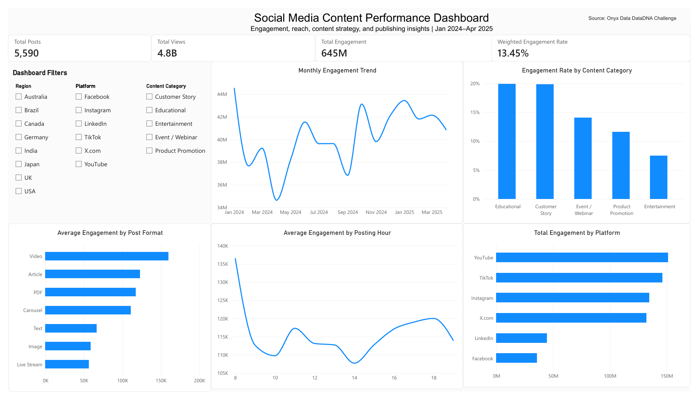

# Social Media Content Performance Analysis



## Project Overview

This project analyzes 5,600 social media posts to identify the platforms, content categories, post formats, publishing times, hashtags, and regions associated with stronger engagement performance.

PostgreSQL was used to profile, clean, validate, and analyze the dataset. Power BI was then connected to the cleaned PostgreSQL table to create an interactive dashboard with KPI cards, charts, filters, and reusable DAX measures.

The dashboard focuses on January 2024 through April 2025. Ten records from May 2025 were excluded from dashboard calculations because they represented an incomplete month.

## Business Questions

The analysis was designed to answer the following questions:

* WhichWhich platforms generate the greatest total engagement?
* Which content categories achieve the highest engagement rates?
* Which post formats generate the strongest average engagement?
* What posting hours are associated with better performance?
* Which hashtags and content strategies consistently perform well?
* How do organic and sponsored posts compare?
* Which geographic regions show the strongest engagement efficiency?

## Tools Used

* PostgreSQL
* pgAdmin 4
* Power BI Desktop
* Power Query
* DAX
* GitHub

## Data Preparation

The original dataset contained 5,600 rows. The cleaning and validation process included:

* Creating separate raw and cleaned PostgreSQL tables
* Adding a unique `record_id` for reliable row identification
* Standardizing platform and content-category values
* Validating dates, posting hours, views, and engagement rates
* Investigating 600 repeated post IDs
* Confirming that no completely duplicated rows were present
* Preserving missing click data as `NULL` rather than replacing it with zero
* Separating complete click-tracking records from posts without click data
* Excluding 10 incomplete May 2025 records from dashboard-level reporting

## Dashboard KPIs

For the complete January 2024–April 2025 reporting period:

* Total Posts: 5,590
* Total Views: approximately 5 billion
* Total Engagement: approximately 645 million
* Weighted Engagement Rate: 13.45%

Weighted engagement rate was calculated as:

```text
Total Engagement ÷ Total Views
```

This method accounts for differences in post reach and avoids treating a low-view post as equally influential as a high-view post.

## Key Findings

### Platform Performance

* YouTube generated the highest total engagement and views.
* Instagram achieved the highest weighted engagement rate.
* TikTok generated the highest total clicks, partly because it had substantially more posts with click data.
* Facebook achieved the highest weighted click-through rate at 2.07%, followed by LinkedIn at 2.02% and TikTok at 1.76%.

### Content Strategy

* Educational content produced the highest total engagement and the highest weighted engagement rate at approximately 19.89%.
* Customer Story content ranked closely behind with an engagement rate of approximately 19.83%.
* Product Promotion generated the highest average engagement per post.
* Educational and Customer Story videos averaged approximately 158,651 engagements per post, compared with 101,814 for all other content.
* These videos achieved a 19.87% weighted engagement rate, compared with 11.61% for all other content.

### Post Format

* Video generated the highest total and average engagement.
* Image posts achieved the highest weighted engagement rate at approximately 16.38%.
* PDF posts also performed efficiently, but their sample size was only 16 posts and should therefore be interpreted cautiously.
* The strongest post format differed by platform: Video led on Instagram, TikTok, and X.com, while Article led on LinkedIn.

### Publishing Time

* Posts published at 8:00 AM generated the highest average engagement, although the sample size was relatively small.
* Posts published around 4:00–5:00 PM combined strong engagement with much larger sample sizes, making this period a more dependable publishing window.
* Weekend posts achieved strong weighted engagement rates, with Sunday and Saturday leading.
* Saturday and Wednesday produced the highest average engagement per post.

### Hashtag Performance

* `#SuccessStory` achieved the highest weighted engagement rate at approximately 19.92%.
* `#CustomerStory` followed closely at approximately 19.84%.
* Both hashtags had large sample sizes, strengthening confidence in the results.
* `#ProductDemo` generated the highest average engagement per post.

### Regional Performance

* The United States generated the highest total engagement.
* Japan achieved the highest average engagement per post.
* Brazil recorded the highest weighted engagement rate at approximately 13.77%, followed closely by India at 13.75%.
* Regional sample sizes were relatively balanced, ranging from approximately 627 to 752 posts.

## Recommendations

* Prioritize Educational and Customer Story content, particularly in video format.
* Adapt format strategy by platform rather than using one format everywhere.
* Schedule important posts during the 4:00–5:00 PM period, while continuing to test the high-performing 8:00 AM window.
* Use `#SuccessStory` and `#CustomerStory` in relevant campaigns.
* Maintain organic content for engagement efficiency while using sponsored content when maximizing average reach is the priority.
* Evaluate campaigns using both total engagement and weighted engagement rate to distinguish scale from efficiency.
* Treat results from formats with small sample sizes cautiously and collect additional data before increasing investment.

## Repository Structure

```text
social-media-content-performance-analysis/
├── 01_data_profiling.sql
├── 02_data_cleaning.sql
├── 03_content_performance_analysis.sql
├── dashboard.png
├── social_media_content_performance_dashboard.pdf
├── social_media_content_performance_dashboard.pbix
└── README.md
```

## SQL Workflow

* `01_data_profiling.sql` examines row counts, missing values, repeated identifiers, category consistency, and numeric ranges.
* `02_data_cleaning.sql` creates the cleaned analysis table and standardizes the dataset.
* `03_content_performance_analysis.sql` contains the platform, content, format, timing, hashtag, geographic, click-through, and top-post analyses.

## Limitations

* Click and click-through-rate data were available only for Facebook, LinkedIn, and TikTok.
* Missing click values were treated as unavailable data rather than zero clicks.
* May 2025 contained only 10 posts and was excluded from the dashboard reporting period.
* Engagement results indicate association, not causation.
* Small-sample formats such as PDF require additional observations before broad conclusions can be made.

## Data Source

Onyx Data — DataDNA Social Media Content Performance Dataset Challenge, June 2025.
